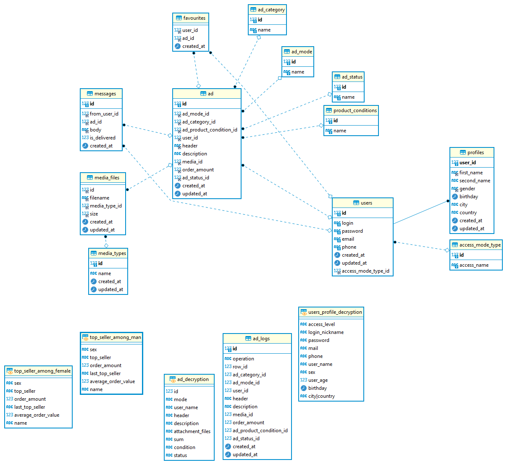

# Итоговый проект по курсу базы данный MySQL
___
   
           
### ТЗ к проекту
___
1. Составить общее текстовое описание БД и решаемых ею задач;
2. минимальное количество таблиц - 10;
3. скрипты создания структуры БД (с первичными ключами, индексами,
внешними ключами);
4. создать ERDiagram для БД;
5. скрипты наполнения БД данными;
6. скрипты характерных выборок (включающие группировки, JOIN'ы, вложенные
таблицы);
7. представления (минимум 2);
8. хранимые процедуры / триггеры;
  
Права пользователей:
  - Писать продавцам
  - Создавать учетные записи
  - Опубликовать свои объявления
  - Прикреплять медиафайлы к объявлениям
  - Добавлять понравившиеся объявления в избранное
  
### Описание БД
___

  База данных avito_db_model представляет собой копию БД сервиса Avito. БД позволяет хранить данные пользователей, которые используются для регистрации и в качестве контактной информации,объявления на продажу, которые разместили пользователи. На основании таблицы с объявлениями (description) можно получить аналитику по продажам в разрезах по качеству товара, категории, привилегии объявления
  USERS - в таблице сохраняются данные для входа и авторизации.

  PROFILES - в таблице хранятся персональные данные пользователей 

  DESCRIPTION - в таблице хранится описание объявлений
  
  
  

